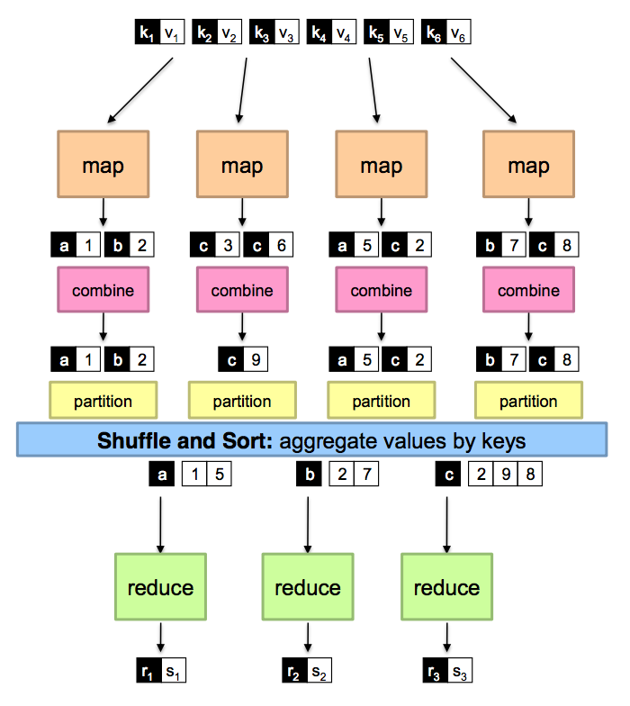

All right, this git repo is me working through [Harvard's 2015 CS109 class](http://cs109.github.io/2015/), one lab at a time. This class was recommened at Quora and a few other places as being a good resource for practical data science, so here goes. My notes are here in the readme file as I work through the [course syllabus](http://cs109.github.io/2015/pages/schedule.html) and the [labs and homeworks](https://porter.io/github.com/cs109/content). 

The stuff to watch and work through:
- [Lecture videos & notes](http://cs109.github.io/2015/pages/videos.html)

Note: download the videos using [this script](https://github.com/christopher-beckham/cs109-dl-videos), and merge [pull request 11](https://github.com/christopher-beckham/cs109-dl-videos/pull/11) to get the 2015 videos.

**Study Suggestions before starting:**

- Use a internet blocker app like [SelfControl](https://selfcontrolapp.com/) to stop procrastinating and a [pomodoro app](http://tomighty.org/) to break up study into chunks. 
- Use a paper notebook for notes as you watch the videos and do the labs.
- Get a second monitor so you can watch videos/have lab notebooks open and work through at the same time. (I got a 1440p 27inch monitor from ebay and it made things so much easier from just using my laptop).
- Don't look at the lab and hw answers - try to do them first on your own. Discuss with others before looking at solutions.

# CS109 notes, by the class schedule:

## Week 1: What is Data Science

[Lecture 1](https://github.com/khalido/cs109-2015/blob/master/Lectures/01-Introduction.pdf) introduces data science. The basic stuff covered in every blog post.

## Week 2: Intro Data Analysis and Viz

The [lecture 2 notebook](https://github.com/khalido/cs109-2015/blob/master/Lectures/02-DataScraping.ipynb) goes through getting data and putting it into a pandas dataframe.

Lab 1 has three very introductory notebooks: [pythonpandas](https://github.com/khalido/cs109-2015/blob/master/Labs/2015lab1/Lab1-pythonpandas.ipynb), followed by [babypython](https://github.com/khalido/cs109-2015/blob/master/Labs/2015lab1/Lab1-babypython.ipynb), and finally [git](https://github.com/khalido/cs109-2015/blob/master/Labs/2015lab1/Lab1-git.ipynb). However, since the course dates back to 2015, some of the python is a bit dated and uses 2.x code. 

After doing the three intro notebooks, [hw0](https://github.com/khalido/cs109-2015/blob/master/Labs/2015lab1/hw0.ipynb) runs you through installing anaconda, git, and setting up a github and aws account.

Hw0 has one interesting section, where you solve the [montyhall problem](https://en.wikipedia.org/wiki/Monty_Hall_problem) one step at a time. I didn't really like their steps, so made a [simpler monty hall implementation](https://github.com/khalido/algorithims/blob/master/monty_hall.ipynb).

Moving on to the [Lecture 2](https://github.com/khalido/cs109-2015/blob/master/Lectures/02-DataScraping.ipynb) & its [quiz notebook](https://github.com/khalido/cs109-2015/blob/master/Lectures/02-DataScrapingQuizzes.ipynb), this goes through some more pandas and data scraping web pages and parsing them.

I made a couple of notebooks expand on some of the stuff covered:

- [movielens notebook for basic pandas](https://github.com/khalido/cs109-2015/blob/master/movielens.ipynb) workflow of downloading a zip file, extracting it and putting into pandas dataframes and doing some q&a
- [twitter notebook](https://github.com/khalido/cs109-2015/blob/master/twitter.ipynb) - basic usage of twitter api and doing something with tweets 

**Lecture 3** ([slides](https://github.com/khalido/cs109-2015/blob/master/Lectures/03-EDA.pdf), [video](https://matterhorn.dce.harvard.edu/engage/player/watch.html?id=a4e81697-fd86-415c-9b29-c14ea7ec15f2)):

 - ask a q, get data to answer it, explore & check data, then model it and finally communicate and visualize the results.
 - keep viz simple and think of the [kind of chart](http://extremepresentation.typepad.com/blog/files/choosing_a_good_chart.pdf) needed. 


## Week 3 : Databases, SQL and more Pandas

[Lab 2](https://github.com/khalido/cs109-2015/blob/master/Labs/2015lab2/Lab2.ipynb) introduces web scraping with [requests](http://docs.python-requests.org/en/master/) and then parsing html with [beautiful soup 4](https://www.crummy.com/software/BeautifulSoup/bs4/doc/).

Lecture 4 ([video](https://matterhorn.dce.harvard.edu/engage/player/watch.html?id=f8a832cb-56e7-401b-b485-aec3c9928069), [slides](https://github.com/cs109/2015/raw/master/Lectures/04-PandasSQL.pdf)) (covers some more [Pandas and SQL](https://github.com/khalido/cs109-2015/blob/master/Lectures/Lecture4/PandasAndSQL.ipynb).

Lecture 5 ([slides](https://github.com/cs109/2015/raw/master/Lectures/05-StatisticalModels.pdf), [video](https://matterhorn.dce.harvard.edu/engage/player/watch.html?id=873964c6-d345-4f46-a8bc-727b96432d63)) on stats is a bit sparse. Some supplementary material:
- [Stanford Statistics Course](https://lagunita.stanford.edu/courses/course-v1:OLI+ProbStat+Open_Jan2017/info) - check on this one vs the MIT one.
 - [Think Stats](http://greenteapress.com/thinkstats2/index.html) is a good basic book covering stats using Python.
 - [Think Bayes](http://greenteapress.com/wp/think-bayes/) follows on from Think Stats and covers Bayesian stats in Python.

## Week 4: Probablity, regression and some stats

[Lab 3](https://github.com/khalido/cs109-2015/tree/master/Labs/2015lab3) has three notebooks:
- [Lab3-Probability](https://github.com/khalido/cs109-2015/blob/master/Labs/2015lab3/Lab3-probability.ipynb) covers basic probability. Uses a lot of numpy methods, so its a good idea to brush up on numpy.
    - [scipy.stats](https://docs.scipy.org/doc/scipy/reference/stats.html) - very handy, has most stats stuff needed for DS built in.
- [Lab3-Frequentism, Samples and the Bootstrap](https://github.com/khalido/cs109-2015/blob/master/Labs/2015lab3/Lab3-Freq.ipynb)
    - use seaborn for plotting, very handy. a [good guide to sns factorplot and facetgrids](http://blog.insightdatalabs.com/advanced-functionality-in-seaborn/)
    - [PDF](https://en.wikipedia.org/wiki/Probability_density_function) tells us the probability of where a continuus random variable will be in set of possible values that random variable can be (the sample space).
    - [PMF](https://en.wikipedia.org/wiki/Probability_mass_function) tells us the probability that a discrete random variable will be ecactly equal to some value
    - [CDF](https://en.wikipedia.org/wiki/Cumulative_distribution_function) function tells us the probability that a random discrete or continous variable X will take a value less than or equal to X. [Video](https://youtu.be/bGS19PxlGC4?list=PLF8E9E4FDAAA8018A)

### Lecture 6: Story Telling and Effective Communication ([slides](https://github.com/cs109/2015/raw/master/Lectures/06-StoryTelling.pdf), [video](https://matterhorn.dce.harvard.edu/engage/player/watch.html?id=afe70053-b8b7-43d3-9c2f-f482f479baf7)) 

Good insights on how to tell a story with data. Infer, model, use an algorithim and draw conclusions (and check!).  

- Start with two fundamental questions:
    - Whats the goal? think first of that rather than going first to all the many ways you can slice and dice data.
    - Who cares? Know your audience and tell them a story. Have a clear sense of direction and logic. 
- Read some howto's on scientific writing
- have some memorable examples or small stories

Tell a story:
- know your audience and why/what they care about this data - what do they want?
- Don't make them think - clearly tell them what you want them to know in a way they can follow. highlight key facts and insights. 
- unexpectedness - show something the audience didn't expect. I liked the story which highlighted that bigfoot sightings are dropping sharply 
- What tools can we give the audience? For example, a web app for them to further explore the data, or a takeaway presentation with key points.
- be careful of your point of view and don't distort the data, but depending on the audience you can frame your story - for example presenting war deaths in red rather than a regular plot color.
- important to put the message up front - what does my graph show? Show it in stages if a lot of data, highlighting what to look at. Design matters. 

More resources:
- [The Functional Art](http://www.thefunctionalart.com/)

### Lecture 7: Bias and Regression ([slides](https://github.com/cs109/2015/raw/master/Lectures/07-BiasAndRegression.pdf), [video](https://matterhorn.dce.harvard.edu/engage/player/watch.html?id=afe70053-b8b7-43d3-9c2f-f482f479baf7))

- think about bias, missing data, etc
- combine independent, unbiased estimators for a parameter into one:
    - fisher weighting
    - nate silver weighting method
- Bonferroni
- good segment on weighting variables
- regression towards the mean
- think of regression in terms of population or a projection of the column space of x - i.e what combination of the variables of x gets us closest to the value of y?
- linear regression means we're taking linear combination of predictors, the actual regression equation can be nonlinear
- what function of x gives the best predictor of y? 
- Gauss-Markov Theorem
- the residuals are the diff  b/w the actual value of y and the predicted value - plot residuals vs fitted values and vs each predictor variable - good way to eyeball quality of linear regression model
- variance R^2 measures goodness of fit, but doesn't mean model is good. 
- Best way to check a model is prediction.

## Week 5: Scikit learn & regression

### Lab 4 - Regression in Python ([video](https://matterhorn.dce.harvard.edu/engage/player/watch.html?id=483c8b93-3700-4ee8-80ed-aad7f3da7ac2), [notebook](https://github.com/khalido/cs109-2015/blob/master/Labs/2015lab4/Lab4-stats.ipynb))

- [Wikipeda article](https://en.wikipedia.org/wiki/Linear_regression)
- We have data X, which is related to Y in some way.
- Linear regression uses X to predict Y, and also tells us the predictive power of each variable of X
- Linear regression assumes the distribution of each Y is normal (which isn't always so)
- there are many ways to fit a linear regression model, most common is the [least squares](http://en.wikipedia.org/wiki/Least_squares) method
- be careful that the features (variables in X) aren't too similar
- explore your data, plot variables, scatterplots etc. Use seaborn to plot regression.
- use [sklearn to split dataset into a train/test](http://scikit-learn.org/stable/modules/generated/sklearn.model_selection.train_test_split.html)
- use [cross-validation](http://scikit-learn.org/stable/modules/cross_validation.html) 
- overfitting happens when the model 'learns' the train data so performs better on that than the test dataset
- there are [many types of regressions](http://www.datasciencecentral.com/profiles/blogs/10-types-of-regressions-which-one-to-use) so think about which one to use
- for high d data, closed form vs gradient decent:
    - closed form - use math to solve. this becomes computationally intensive very quickly, is ordered n cubed
    - gradient descent is O(n), so for large high d data it's gradient descent all the way
- Logistic regression - used where outcome is binary, for example a chance of success/failure. read:[Adit's explanation.](http://adit.io/posts/2016-03-13-Logistic-Regression.html)

### Lecture 8: More Regression ([video](https://matterhorn.dce.harvard.edu/engage/player/watch.html?id=664f668e-e008-4f44-8600-e09ee6d629b0), [slides](https://github.com/khalido/cs109-2015/blob/master/Lectures/08-RegressionContinued.pdf))

- collinerarity - when some variables are highly correlated with each other - this is bad
- Logistic Regression
- Odds Ratio: ratio of two different people's odds of an outcome.
- Crude Odds Ratio Estimate - quick estimate but flawed as doesn't control for anything.
- Confounding Factors - i.e is one group pre-disposed to our outcome for some reason?
- Curse of dimensionality - in high d settings, vast majority of data is near boundaries, not center. But, high d can also be a [blessing](http://andrewgelman.com/2004/10/27/the_blessing_of/).
- dealing with high dimensionality: ridge regression, shrinkage estimation
- Stein's Paradox [wikipedia](https://en.wikipedia.org/wiki/Stein%27s_example), [good article](http://statweb.stanford.edu/~ckirby/brad/other/Article1977.pdf)
- LASSO and Ridge help with high D data by reducing features
    - Lasso does L1 regularization, reduces number of features
    - Ridge does L2 regularization, doesn't necessarily reduce features but reduces the impace of features on the model by reducing coefficient value
- Elasticnet does both L1 and L2 regularization

### Lecture 9: Classification ([video](https://matterhorn.dce.harvard.edu/engage/player/watch.html?id=c322c0d5-9cf9-4deb-b59f-d6741064ba8a), [slides](https://github.com/khalido/cs109-2015/blob/master/Lectures/09-ClassificationPCA.pdf))

- we take data and assign labels
- 1 nearest neighbour - simple classification method for low d data
    - slow, has to check all points to find nearest neighbour
- k nearest neighbours - use k nearest points to find decision boundary
    - find ideal k 
    - what distance function to use? 
    - my own very simple [kNN algo implementation](https://github.com/khalido/algorithims/blob/master/k%20nearest%20neighbours.ipynb)
- cross validation - for 5 fold cross validation, the data is split into 6 folds - 4 for training, one for validation and the sixth for testing, which is only used at the end.
- CIFAR-10 for 60K images - is split into 50K training and 10K test
    - pics are 32x32x3
- L1 distance is the absolute diff b/w two vectors
- L2 is the Euclidean distance i.e "ordinary" straight-line distance
- for images, l1 and l2 are pretty bad, so there are a lot more methods
- more features are good for classification, but too many features means the data gets sparse - the curse of dimensionality strikes
- so often we want to reduce dimensionality
- Principal Component Analysis - project a dataset from many variables into fewer less correlated ones, called the principal components. 
- Singular Value Decomposition (SVD) - computational method to calculate pricipal components of a dataset. It transforms a large matrix of data into three smallter matrixes: `A (m*n) = U(m*r) x E(r*r) x V(r*n)`. The values in the middle matrix `r*r` are the *singular* values and we can discard bits of them to reduce the amount of data to a more manageable number. 
- [good pca and svd explanation](https://medium.com/machine-learning-for-humans/unsupervised-learning-f45587588294)
- Watch [Statistics for Hackers](https://www.youtube.com/watch?v=Iq9DzN6mvYA)

### HW2 Q1 ([notebook](https://github.com/khalido/cs109-2015/blob/master/homework/HW2.ipynb))

- Uses svd and pca to analyze gene data
- a pandas excercise in downloading csv files into a data frame, usijng pd.datetime and visualising samples vs time

## Week 6: SVM, trees and forests

Now the course finally gets interesting. Before starting this weeks work, think about project ideas and see [Hans Rosling](https://www.gapminder.org/videos/) videos to see how to present data. Pitch this project idea (to study group or the internet at large).

There are quite a few companies automating the entire datascience chain, so the key is being able to present your findings well.

### HW 2 Questions 2,3 & 4 ([notebook](https://github.com/khalido/cs109-2015/blob/master/homework/HW2.ipynb))

H2 depends wholly on week 5, so good idea to get it done first. Used seaborn for all the viz questions makes some of them trivial.

- q2 looks at polling data and bias
- q3 is more of the same but with seaborn
- q4 nothing much to see here besides using list comprehensions to make a list of all the .csv files _(I'm trying to use python to do all the work instead of my stone age past life of copying and pasting links)_

```python
url_str = "http://elections.huffingtonpost.com/pollster/api/charts/?topic=2014-senate"
election_urls = [election['url'] + '.csv' for election in requests.get(url_str).json()]
```


### Lab 5: Machine Learning

**Learning Models** ([notebook](https://github.com/khalido/cs109-2015/blob/master/Labs/2015lab5/LearningModels.ipynb), [video](https://matterhorn.dce.harvard.edu/engage/player/watch.html?id=e509f996-9633-4b75-a48a-e29246a316db))

- we often have a small sample of a much dataset, and we want to predict the larger data from our sample.
- this isn't just statistical analysis, as we make models which involve domain knowledge and choices.
- need to think about whether our sample is in some way representative of the population
- Stochastic noise, i.e randomness
- systematic error, i.e where the sampling isn't representative, like polling ppl using landlines
- overfitting: models can 'memrize the the data points in the training set, becoming useless or inaccurate at predicting real world data. With many data sets a more and more complex dataset will keep getting better while getting worse on test/validation data. The best model minimizes test set error, and not training set error.
- great illustration of variance at 24:30 and 35min in the video
- use `from sklearn.cross_validation import train_test_split` for splitting datasets into a train test split. See [sklearn](http://scikit-learn.org/stable/)
- sklearn has 3 main features:
    - build and fit models
    - predict
    - transform data.
- sklearn expects days in a 2d array or a matrix of size `[n_samples, n_features]`, so reshape 1d data using `np.reshape(-1,1)`
- Validation - keep a chunk of data seperate to check the model after training on the test/train data.
- Cross Validation: randomly split data into K diff train/test splits - so you traion on K-1 partitions and test on 1, so there are a total of K combinations, leading to K risks. This leads to better results then just doing one test/train split. 
- regularization helps with overfitting

**Classification** ([notebook](https://github.com/khalido/cs109-2015/blob/master/Labs/2015lab5/Classification.ipynb), [video](https://matterhorn.dce.harvard.edu/engage/player/watch.html?id=90e73c64-855c-4b06-afb2-94da608ecfbf))

- sort data into classes, i.e what kind of fruit
- most datasets can be projected onto a lower dimensial space, for e.g using PCA
- read sklearn's PCA docs
- kNN:
- Logistic Regression - use [sklearn](http://scikit-learn.org/stable/modules/generated/sklearn.linear_model.LogisticRegression.html), main paramater is C which defines how much to regularize the data. Read [this explanation](http://adit.io/posts/2016-03-13-Logistic-Regression.html)
- Use sklearns [GridSearchCV](http://scikit-learn.org/stable/modules/generated/sklearn.model_selection.GridSearchCV.html) to find hyperparameters
- one way to classify: use [PCA](http://scikit-learn.org/stable/modules/generated/sklearn.decomposition.PCA.html) to reduce the feature space, then use logistic regression to classify 
- many datatypes, like images, have tons of features, so important to reduce dimensionality.
- [sklearn PCA](http://scikit-learn.org/stable/modules/generated/sklearn.decomposition.PCA.html) returns the principal components in order of how much they explain the data:

```python
from sklearn.decomposition import PCA
pca = PCA(n_components=60) # PCA with no. of components to return
X = pca.fit_transform(data)
print(pca.explained_variance_ratio_) # how much of variance is explained
```

- sklearn uses the same interface for all its classifiers, so makes it easy to put a wrapper around gridsearchCV and pass in diff classifiers to compare.
- discriminative classifier - finds the decision boundary b/w classes
- maximum-margin classifier - for many classifincation problems, multiplie diff lines can seperate classes. Choose that line where the margin b/w classes is the largest, which makes this model senstive to boundaries b/w classes, rather than to point samples deep inside a class. 
- SVM is a discrimant classier which finds the widest possible margin b/w classes, including some points touching the boundary which are called the support vectors. (since they support or establish the margins.)


### Lecture 10: SVM, Evaluation ([video](https://matterhorn.dce.harvard.edu/engage/player/watch.html?id=f21fcc8f-93a8-49f6-9ff8-0f339b0728bd), [slides](https://github.com/cs109/2015/raw/master/Lectures/10-SVMAndEvaluation.pdf))

- KNN - training is fast, prediction slow since we need to check all the data points to find the nearest neighbours
- but if we know the decision boundary (the seperating hyperplane) we don't need all the data points
    - w: weight vector defines the orientation of the hyperplane, and bias b. 
    - so a new point x is classified by `w(transpose)*x + b`
    - this is the mathematical model of a neuron, invented 1957 by Rosenblatt
- step function vs sigmoid activation
- Support Vector Machines (SVM) are widely used, some consider it best of the shelf classifier. They add a new dimension to help seperate classes and also use maximum margin classification. SVM is called svm becuase of the support vectors defining the max margin lines for the classification boundary.
- large data is good for training svm as the points on the boundary are rare and svm cares about establishing the boundary
- since outliers can change the svm boundaries, there is a concept of slack variables - it allows the SVM to missclassify outliers to make a neat decision boundary. sklearn uses the parameter C to define the slack. the lower the number the more the slack.
- kernel tricks for svm - go to aribitarily mary dimensions with little computational cost. need to think about what kernel to use. Read [What are kernels in machine learning and SVM and why do we need them?](https://www.quora.com/What-are-kernels-in-machine-learning-and-SVM-and-why-do-we-need-them).
- read [Andrew Ng's cs229 svm notes](http://cs229.stanford.edu/notes/cs229-notes3.pdf)
- todo: tale sklearns 'faces' dataset and use svm to predict
- svm tips:
    - normalize data to 0,1 or -1,1 interval. (check whether the library already normalizes)
    - RBF kernel is a good default
    - Read Chich-Wei Hsu practical guide to SVM
    - tune paramaters - which kernel, what parameters for it and what C?
- ROC curve: plot true positive rate vs false positive rate
    - true +ve is tp/(tp+fn)
    - false +ve is fp/(fp+tn)
    - one useful summary stat is area under the curve
- Precision Recall Curve [sklearn](http://scikit-learn.org/stable/auto_examples/model_selection/plot_precision_recall.html), [quora](https://www.quora.com/What-is-Precision-Recall-PR-curve)
    - Precision: `tp/(tp+fp)` - how much are we getting right, or the probability a a random +ve sample is actually +ve (since some +ve samples are false positives).
    - Recall `tp/(tp+fn)` - same as in the ROC, how much of the data are we finding. for a random +ve sameple, the probability that it's making a correct prediction. (consider the false negatives.)
    - ideally we want both to be one.
- good way to compare classifiers
- How do you classify multple classes with a SVM, e.g 10 types of fruit
    - One vs all - pick one class, and train it against all the other classes one by one. So you train n classifers for n classes.
    - One vs One - Train n(n-1)/2 classifiers, take majority vote
    - use a confusion matrix of predicted label vs true labels to see classification results

### Lecture 11: Decision Trees and Random Forests ([video](https://matterhorn.dce.harvard.edu/engage/player/watch.html?id=8892a8b7-25eb-4bc5-80b6-47b9cf681a05), [slides](https://github.com/khalido/cs109-2015/blob/master/Lectures/11-DecisionTreesAndRandomForest.pdf))

- Books: Read [Elements of Statiscal Learning](https://web.stanford.edu/~hastie/ElemStatLearn/) and [Pattern Recognition and Machine Learning](https://www.microsoft.com/en-us/research/people/cmbishop/)
- Decision Tree - fast training and prediction, easy to understand and interpret. DT basically paritions a feature space into cells using a series of decision rules on one feature at a time
- which feature to query and what thresholds to use?
- node purity: do splits so cells are pure, i.e have only one class in them
    - Gini Impurity gives us the expected error of predicted a class from a random sample
    - Gini Index
    - Node purity gain: compare gini impurity of parent vs child nodes. Lets us see whether a split has improved classification better than a simple missclassification number.
- Optimal trees - diff ways to get there
- Tree pruning - easy to overfit, so first we make the tree, then go backwards and remove 'bad' decisions, or merge cells etc.
- DT disadvatages: sensitive to small changes in data, overfit, only axis aligned splits
- DT vs SVM: 
- Netflix prize winners used an ensemble of over 800 models. somewhat disapointing as they didn't come up with a new method
- DT doesn't perform well, but what if we use many of them?
- Bootstrap is one way to do this. It's a resampling method from statistics, useful to get error bags on estimates.
    - Bootstrap lets us generate more sample sets from one dataset, each one slightly different.
    - Take N data points and draw N times with replacement, then get an estimate from each bootstrapped samples. 
    - bagging: bootstrap aggregrating, where you learn a classifer from each bootstrap sample and average the . (normally uses just one type of classifier)
        - See [bootstrap example notebook](https://github.com/khalido/cs109-2015/blob/master/Bootstrapping.ipynb)
        - bagged DT's perform better than one a single tree
        - not useful for linear models
    - Bias-Variance trade off: train models with a high variance, then the average might get close  
- **Random Forest** builds on bagging, builds a tree from each bootstrap sample with node splits selected from random feature subsets. See [1](http://blog.yhat.com/posts/random-forests-in-python.html), or rather [2](https://chrisalbon.com/machine-learning/random_forest_classifier_example_scikit.html)


## Week 7: Machine Learning best practices

[HW 3 Q1 due](https://github.com/khalido/cs109-2015/blob/master/homework/HW3.ipynb): a lot of pandas manipulation on baseball data

Start the [project](http://cs109.github.io/2015/pages/projects.html)

> Towards the end of the course you will work on a month-long data science project. The goal of the project is to go through the complete data science process to answer questions you have about some topic of your own choosing. You will acquire the data, design your visualizations, run statistical analysis, and communicate the results. You will work closely with other classmates in a 3-4 person project team.

### Lab 6: Machine Learning 2

**Classification, Probabilities, ROC curves, and Cost** ([video](https://matterhorn.dce.harvard.edu/engage/player/watch.html?id=83dfe4c9-fa1b-429c-a84c-839195fbede8),[notebook](https://github.com/cs109/2015lab6/blob/master/lab6-classification-redux.ipynb))

- Not a very useful lab, essentially better of from sciki-learn understand how to use:
    - [Logistic Regression](http://scikit-learn.org/stable/modules/generated/sklearn.linear_model.LogisticRegression.html)
    - [SVM](http://scikit-learn.org/stable/modules/svm.html), or [swm with kernels](http://scikit-learn.org/stable/modules/generated/sklearn.svm.SVC.html) - [good tutorial](https://www.oreilly.com/learning/intro-to-svm)
    - [Confusion Matrix](http://scikit-learn.org/stable/modules/generated/sklearn.metrics.confusion_matrix.html)

**Comparing Models** ([video](https://matterhorn.dce.harvard.edu/engage/player/watch.html?id=4676adde-557f-469b-bca8-5ffe868094eb), [notebook](https://github.com/cs109/2015lab6/blob/master/lab6-churn.ipynb))

- learn Bayes classifiers in sklean
- use [ROC](https://en.wikipedia.org/wiki/Receiver_operating_characteristic) curves - often accuracy is the the relevant, the true +ve and false -ve rate is more important. Since False negatives can be costly, you often want to change the threshold probability from the default 0.5. So write your own prediction function as the sklearn one uses 0.5, or with bayes classifiers adjust the prior probability. 
- sklearn has a [roc function](http://scikit-learn.org/stable/auto_examples/model_selection/plot_roc.html#sphx-glr-auto-examples-model-selection-plot-roc-py), [tutorial](http://benalexkeen.com/scoring-classifier-models-using-scikit-learn/)

### Lecture 12: Ensemble Methods (([video](https://matterhorn.dce.harvard.edu/engage/player/watch.html?id=4831ebf0-7832-42c5-9339-5b5e08dd3e92), [slides](https://github.com/cs109/2015/blob/master/Lectures/12-Ensemble%20Learning%20and%20Random%20Forests.pdf)))

- philisophical point: who do ensenble methods work so well? in real life wisdom of the crowds is overrated, but it does a lot better in computerland. Some averaging methods pick up useful stuff in the data, while others cancel out each others errors.
- Decision trees are easy but have poor predictive accuracy, tend to ovefit
- Ensemble learning combines many learners using methods like weighted avg, boosting, etc. See [sklearn's ensemble page](http://scikit-learn.org/stable/modules/ensemble.html)
- [random forests](http://scikit-learn.org/stable/modules/ensemble.html#forest) is an extension of bagging of decision trees
    - random forests using sqrt(features) of random predicters to make trees give the best results
- Boosting is another ensemble method like bagging, but better for most applications. 
    - tune by num of trees, splits in each tree, weights
    - often using very simple trees, which you adjust the weights as u make more trees to classify better the things u got wrong. At the end u make a weighted avg.
    - most popular & succesful boosting algorithim is [AdaBoost](http://scikit-learn.org/stable/modules/ensemble.html#adaboost)

Note: read [this series on machine learning](https://medium.com/machine-learning-for-humans/why-machine-learning-matters-6164faf1df12)

### Lecture 13: Best Practices ([video](https://matterhorn.dce.harvard.edu/engage/player/watch.html?id=b33eec92-d049-4353-a904-5054eb718aff), [slides](https://github.com/cs109/2015/blob/master/Lectures/13-BestPractices_Recommendations.pdf))

- story telling is important for data scientists - explain whats going on, even in your own notebooks. good presentation is very important.
- Diff b/w bagging and random forest: rf has bagging idea + random feature subsets
- didn't really find this video that useful, for example:
    - knn and trees can be used for regression too, but why would we?
    - SVM's can be used for regression
- take care to normalize your data in a sane manner

## Week 8: EC2 and Spark

HW3 [q2](https://nbviewer.jupyter.org/github/khalido/cs109-2015/blob/master/homework/HW3.ipynb#Problem-2) uses the iris data set & [q3](https://nbviewer.jupyter.org/github/khalido/cs109-2015/blob/master/homework/HW3.ipynb#Problem-3:) uses sklearn's digits dataset and gridsearchCV to find best parameters for a KNN classifier for two simple datasets.

### Lab 7: Decision Trees, Random Forests, Ensemble Methods ([video](https://matterhorn.dce.harvard.edu/engage/player/watch.html?id=0c645a5c-d262-4bb5-a137-3a78db60f3e7), [notebook](https://github.com/khalido/cs109-2015/blob/master/Labs/2015lab7/Lab7-Botany%20and%20Ensemble%20Methods.ipynb))

- [decision trees](http://scikit-learn.org/stable/modules/tree.html#tree), but they use their own function on top of sklearn so its a bit annoying
- [random forests](http://scikit-learn.org/stable/modules/ensemble.html#forest):
    - take a random subsample of the data
    - select a subset of all possible variables (at each node) and build the tree on the best split
    - repeat, then finally take a majority vote
- [Ensemble](http://scikit-learn.org/stable/modules/ensemble.html) learning - put together a lot of classifiers to build a better one
- [AdaBoost Classifier](http://scikit-learn.org/stable/modules/ensemble.html#adaboost) uses weights on the training data.
- [Gradient Boost Classifier](http://scikit-learn.org/stable/modules/ensemble.html#gradient-tree-boosting) is similar to AdaBoost but uses tree as its base classifier, can do regression or classification.

### Lecture 14: Best Practices, Recommendations and MapReduce ([video](https://matterhorn.dce.harvard.edu/engage/player/watch.html?id=afee45b9-dcf5-4f29-bc60-871aa78f1cf8), [slides](https://github.com/cs109/2015/raw/master/Lectures/14-Recommendations_MapReduce.pdf))

- should have started final project by now, if not, start now!
- **Nesting:** use 5 fold cross validation, take each fold and further apply 5 fold cv to find the right hyperparameters, then use those params in the original fold to train the classifier.
- think about how and why to normalize data, e.g data already in a range from 0-1 might not need to be normalized, think about normazlization as hyperparameters to your model.
    - get the mean estimates from your training data and use that to normalize training, validation and testing data. these values need to be stored to normalize future data.
- know your application domain
- many problems are to do with imbalanced data. Fixes to get balanced data for training:
    - oversample: take bigger samples of the sparse clasess
    - subsampling: take smaller samples of the more frequently occuring classes 
    - or weight classes so classifier pays more attention to the sparese classes, see [sklearn](http://scikit-learn.org/stable/modules/generated/sklearn.model_selection.StratifiedKFold.html#sklearn.model_selection.StratifiedKFold)
- Missing data, where some of the features are missing for certain samples: 
    - delete, but can reduce data too much 
    - use mean
    - use regression to estimate missing values
- [Collobrative filtering](https://en.wikipedia.org/wiki/Collaborative_filtering) is a common technique for recommendations or filling in missing values. Can be user based or item based.
    - KNN is widely used for collobrative filtering. 
    - SVD is widely used, famously in the netflix contest. watch this [svd video](https://www.youtube.com/watch?v=YKmkAoIUxkU) for a refresher if needed.

Moving on from Machine Learning...

Map reduce is a way to deal with very large data sets by distributing work over many machines. Developed by Google, and Apache Hadoop is a open source implementation.

- data is in key value pairs and is distributed to however many servers
- we write a map function which does something to a key value pair.
- the mapreduce implementation reaggregrates the key value pairs incoming from all the servers (sorted by keys)
- we write a reduce which does something else
- simple mapreduce example: 
    - map takes in sentences, sends them off to diff machines to process, 
    - those machines send back key:value pairs, say we are just counting words so we get back from machine 1: `"the":1`, `"the":1`, `"a":4` and machine 2 sends back "the":4, "a"10, 
    - there can be a combine step here, which takes the output from one mapper and combines it, so the two `the` words from machine 1 become one `"the":2`. this reduces network traffic and makes the work upstream easier. the combine output has to be of the same type as the mapper, since combine is just an optional  optimizatizion step not a DO WORK thing.
    - the mapreduce thingamajig aggregrates all the key:value pairs and sends them to the
    - reduce function, which counts the words and finally we end up with "the":6 and "a":14
    - 
    - Udacity has a [course on mapreduce with hadoop](https://www.udacity.com/course/intro-to-hadoop-and-mapreduce--ud617)


### Lecture 15: MapReduce Combiners and Spark ([video](https://matterhorn.dce.harvard.edu/engage/player/watch.html?id=10964b32-dcdc-49d2-b766-039b707a5c37), [slides](https://github.com/cs109/2015/raw/master/Lectures/15a-MapReduce_Combiner.pdf))

- refresher on mapreduce: it takes away the headache of dealing with machines, clusters, etc
  - be careful on how you use reducers, they shouldn't effect the algorithims effectiveness
  - the reducer should work whether or not the combiner runs
  - you could have a in-mapper combining, but here we are gettting into complex territory
- Why did we switch to map reduce from good old write a function and run it computing to the horror that is map reduce?
  - large large data which looms like a t-rex, scaring our current teeny tiny computers cowering away in fear. luckily the computers gathered in data centers where mapreduce and other such algos can harness them in parallel.
  - many problems are embarrisingly parallel
- [Apache Hadoop](http://hadoop.apache.org/) is an open source implementation of map reduce, built way back in 2006. It provides us a way to store data on clusters of commodity machines and process it using mapreduce, without having to worry about the rocketscience of managing the clusters and splitting data and processes across all the machines. 
- Though these days you probably want to use Hadoop with [Apache Spark](http://spark.apache.org/) running on [Amazon's EMR](https://aws.amazon.com/emr/) or [Google Cloud](https://cloud.google.com/dataproc/).
- python has tools like [dask](https://ipyparallel.readthedocs.io/en/latest/) and [ipyparallel](https://ipyparallel.readthedocs.io/en/latest/) for parallel computing. for many projects python is enough
- Functional programming: where your functions take an input, process it and return an output, without messing around with other functions or data stored elsewhere. this makes so much sense that it shouldn't be a big deal, it sounds like a toyota corolla of the computing world, but its a big deal because ppl manage to write functions which fuck around with your programming world enough that after a few rounds of their unfunctional running around no one has a good idea of whats the actual state of things. 
  - Functional programming is clean! Watch Joel Grus [Learning Data Science Using Functional Python](http://pyvideo.org/pydata-seattle-2015/learning-data-science-using-functional-python.html) or [this one](https://www.youtube.com/watch?v=LkpHQL863mw)
- Getting back to mapreduce, when you are programming functionally, then it makes it possible to distribute the data and computing across different machines as the functions aren't trying to mess with each other. When a machine dies, its no big deal as we know what data and function we sent it to process, we just resend it to some other machine.
  - aside: this is why pandas always outputs a new dataframe whenever we do something, trying to emulate this ideal of not fucking up existing things. Spark also does similar stuff.
- [Apache Spark](http://spark.apache.org/) makes all this easy for us. Runs on top of Hadoop and provides nice interface and methods for all kind of stuff. So nicer, faster, shineir than Hadoop. 
  - Spark stores data on a Resilient distributed dataset (RDD) - a fault tolerant collection of stuff which can be operated on in parallel.
  - the basics of using sparl: write a function, some kind of mapreduce job, spark runs it on the RDD and makes a new processed RDD. 
  - a lot of the pandas style commands work on spark 
  - spark is lazy - it makes a graph of the stuff we want to do and then runs it from start to end every time we execute. so caching is important so we don't keep computing same stuff over and over again
  - explore spark…. _todo_

## Week 9: Bayes!

### Lab 8: Vagrant and VirtualBox, AWS, and Spark ([video](https://matterhorn.dce.harvard.edu/engage/player/watch.html?id=6f1deb9e-051b-4019-99ec-19aee14be9d9), [notebook]())

- Moving on from sklearn...
- ​

### Lecture 16: Bayes Theorem and Bayesian Methods ([video](https://matterhorn.dce.harvard.edu/engage/player/watch.html?id=233f6c34-306f-481b-8ea5-be33076eb6a8), [slides](https://github.com/cs109/2015/raw/master/Lectures/16-BayesianMethods.pdf))

- book recommendations from the lecture: _(the one I liked best in bold)_

  - easy reading: [How Bayes’ Rule Cracked the Enigma Code](https://www.amazon.com/Theory-That-Would-Not-Die-ebook/dp/B0050QB3EQ/ref=tmm_kin_swatch_0?_encoding=UTF8&qid=&sr=) also see her [talk at google](https://www.youtube.com/watch?v=8oD6eBkjF9o).
  - simple stuff, in python: [Think Bayes](http://greenteapress.com/wp/think-bayes/), though maybe too basic 
  - **[Probabilistic Programming & Bayesian Methods for Hackers](http://camdavidsonpilon.github.io/Probabilistic-Programming-and-Bayesian-Methods-for-Hackers/) - text and python code is in [jupyter notebooks](https://github.com/CamDavidsonPilon/Probabilistic-Programming-and-Bayesian-Methods-for-Hackers) which u can clone to your own pc and go through.**
  - Proper textbooks: [Bayesian Data Analysis](http://www.stat.columbia.edu/~gelman/book/) and [Statistical Rethinking](http://xcelab.net/rm/statistical-rethinking/) - this comes with [python examples](https://github.com/aloctavodia/Statistical-Rethinking-with-Python-and-PyMC3).

- Bayes rule: P(A|B) = P(B|A)P(A) / P(B)

- bayes rules tells us how to update our beliefs (the prior) as we get new data, which gives us a new posterior (which is just a fancy word for our new, updated belief). A more [wordy description](http://www.nytimes.com/2011/08/07/books/review/the-theory-that-would-not-die-by-sharon-bertsch-mcgrayne-book-review.html): 

  > The theorem itself can be stated simply. Beginning with a provisional hypothesis about the world (there are, of course, no other kinds), we assign to it an initial probability called the prior probability or simply the prior. After actively collecting or happening upon some potentially relevant evidence, we use Bayes’s theorem to recalculate the probability of the hypothesis in light of the new evidence. This revised probability is called the posterior probability or simply the posterior. 

  - bayes is controversial becuase traditional stats doesn't like giving numbers to unknown thinks, for example bayes essentially makes up the prior. the prior is often our subject belief about something. 
    - however, even when starting out with different priors, given that they aren't ridiculously dogmatic, with a large sample size the different priors will converge
  - discriminative model: focus on predicting y given x, generative model: we simulate the entire model, i.e we can generate x and y
  - naive bayes: assumes probablities are conditionally independent of each other, greatly simplifies the calculations. sometimes unrealistic but works well for many scenarios. [sklearn has bayes, of course](http://scikit-learn.org/stable/modules/naive_bayes.html).
  -  Conjugate prior says that if u start with a family of distributions, like beta, you stay in the same distribution. simplifies computations
  - one way to think about bayesian 

More Reading:

- [Count Baye's intro to bayesian statistics](https://www.countbayesie.com/blog/2016/5/1/a-guide-to-bayesian-statistics)

### Lecture 17: Bayesian Methods Continued ([video](https://matterhorn.dce.harvard.edu/engage/player/watch.html?id=e63c650e-4cf6-4bee-b57e-f16e927ba25a), [slides](https://github.com/cs109/2015/raw/master/Lectures/17BayesianMethodsContinued.pdf))

- you can estimate your prior from the data, though some bayesians would say you're tainting your priors and the data by doing that, but this is an accepted way to get an acceptable prior. 
- the lecture works through examples from a blog, which has collected its bayes posts into this book: [Introduction to Empirical Bayes: Examples from Baseball Statistics](http://varianceexplained.org/r/empirical-bayes-book/). the explanations in the book look great. 

Note: Bayes is simple to do yet hard to understand. So read a number of guides/blogs/posts/[youtubes](http://pyvideo.org/search.html?q=bayes) till it makes sense. Some talks to see:

- [Eric J Ma Bayesian Statistical Analysis with Python PyCon 2017](https://www.youtube.com/watch?v=p1IB4zWq9C8) - 30 min talk, uses PyMC3
- [Christopher Fonnesbeck Probabilistic Programming with PyMC3 PyCon 2017](https://www.youtube.com/watch?v=5TyvJ6jXHYE) - 30min, more PyMC3


## Week 10: Text

hw5

## Week 11: Clustering!

## Week 12: Deep LEarning

## Week 13: Final Project & Wrapup

# Additional Resources

Stuff I found useful to understand the class material better.

- [Computational and Inferential Thinking](https://ds8.gitbooks.io/textbook/content/) - the textbook for UC Berkely's [Foundations of Data Science class](http://data8.org/.
- [Pythonb Data Science Handbook](https://jakevdp.github.io/PythonDataScienceHandbook/)
